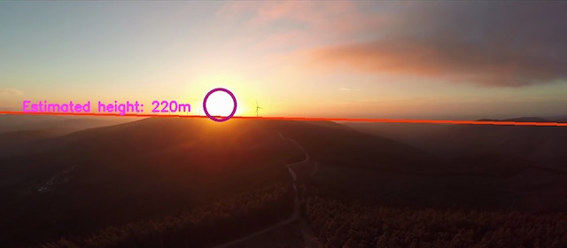

#### Objective

Take a variety of pictures taken from cameras on drones, and try to add as much "human intelligence" to the image as possible. Current features are: a false horizon estimator, sun detector, fog/cloud detector, night detector, and altitude estimation (sort of).

#### Instructions

* The code is Python 3. Dependencies are OpenCV, numpy, and scikit-learn.
* The driver program is ``drone_view.py``. Press ``f`` for next image, or ``esc`` to exit the program.
* The contents of ``./images`` will be loaded by default. Put the images there, or change ``source_files`` in the code. They need to be either ``.jpg`` or ``.png``.

#### Limitations

* This is only using basic computer vision techniques. Some parts would be better done with deep neural networks; at least if the time, expense, and compute available allowed for those. My goal was to see what I could get working quickly, not to beat research benchmarks.
* Horizon finding and altitude estimation are particularly difficult problems. Please don't pilot your drone with this code.
* The image processing pipeline isn't efficient at all: each function that wants a grayscale image does its own conversion.
* Images need to be in RGB. The sun finder uses absolute pixel size filters, so they should be roughly 1280 pixels wide.
* Program has no user input; if you want to change any value, adjust the source code. There are a fair number of hand-selected thresholding parameters and such.

#### Feature Details

##### False Horizon

The idea is that the horizon can be found by looking for a strong transition in brightness along the verticles of the image. It'll be a low frequency transition, so the image is blurred by a Gaussian filter with a large kernel size and sigma. Then a Sobel filter finds the brightness transitions. Only the strongest few percent of these are likely relevant, and even then there can be substantial noise from reflected light, buildings, and other strong brightness transitions. The program feeds the strongest transitions through a RANSAC linear fit to reconstruct the false horizon.

Results are reasonable considering how hard of a problem this is. For pictures of green hills with a clear blue sky overhead, the false horizon will be excellent, even if it's at a steep angle. The filtered edge transitions are shown on the right.

 Problems arise when either the horizon is indistinct, as often happens from hazy coastal conditions, or when there are too many buildings, which drown out the horizon line with their own strong edges.

Note that this partially assumes a straight horizon (ie a rectilinear view). Some drone images come from a fisheye camera with a curved horizon.

##### Sun Finder
The presence of the sun in frame will invariably overexpose the pixels containing it. The sun finder starts by thresholding the image to generate candidate blobs from overexposed pixels, then uses OpenCV's SimpleBlobDetector to filter them by size and rough circularity. Note that a longer focal length lens would potentially result in a sun image too large for the filters as the code stands. Sometimes large swaths of cloud or chunks of the sky itself are overexposed. To prevent false positives, a sun is only detected if it's the dominant overexposed area--the sun blob has to contain at least half the total overexposed pixels in the image.

An example below. The circle of overexposed pixels from the sun is plainly visible. The reflections on the water are small in comparison, so they are ignored.

##### Altitude Estimation
This is more of a curiosity experiment than a serious feature! The idea is that as the drone's altitude increases, atmospheric haze and thermal turbulence will decrease the high frequency spatial information in the image. Variance of Laplaciation is a quick and easy way to measure how much high frequency information is in an image.  I estimated the altitude of 31 sample pictures and fit a cubic regression curve to them. It's almost certainly overfitted, but generating more samples by hand is tedious :) The results are simply hardcoded into the program. I know that's not ideal, but I don't want to bother with configuration files for an experiment like this. Here's what the results looked like...there's just enough correlation to try it.

I think with robust ground segmentation and a consistent imaging system it'd be possible to do better. It'd allow using a FFT and the sensor's maximum MTF to measure high freqency information without as much fear of post-processing and compression artifacts. Varied terrain (buildings versus fields) and variable amounts of in atmospheric interference would always make a regression approach like I used difficult, though.

##### Fog/Cloud Detection
As discussed above, variance of Laplacian is a good way to express image sharpness. Conversely, a low value will indicate a blurry or fuzzy image. What are clouds and fog but giant blurs? If the variance of Laplacian for an image is below a threshold, it's probably cloudy. Probable exception: night time images with no artificial lights at all. Such images would probably just be solid black for a drone camera, though.

##### Night Detection
Count the number of near black pixels. If it's a large fraction of the image, the drone is probably in the dark, which is assumed to be night.
